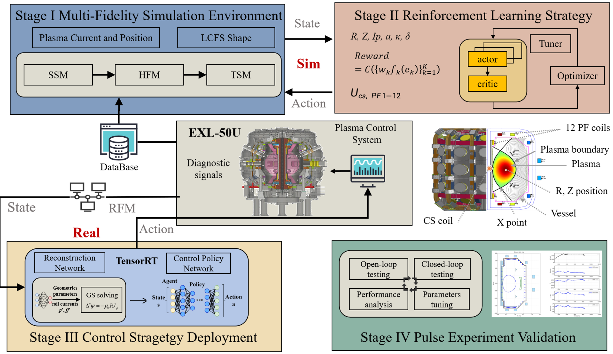
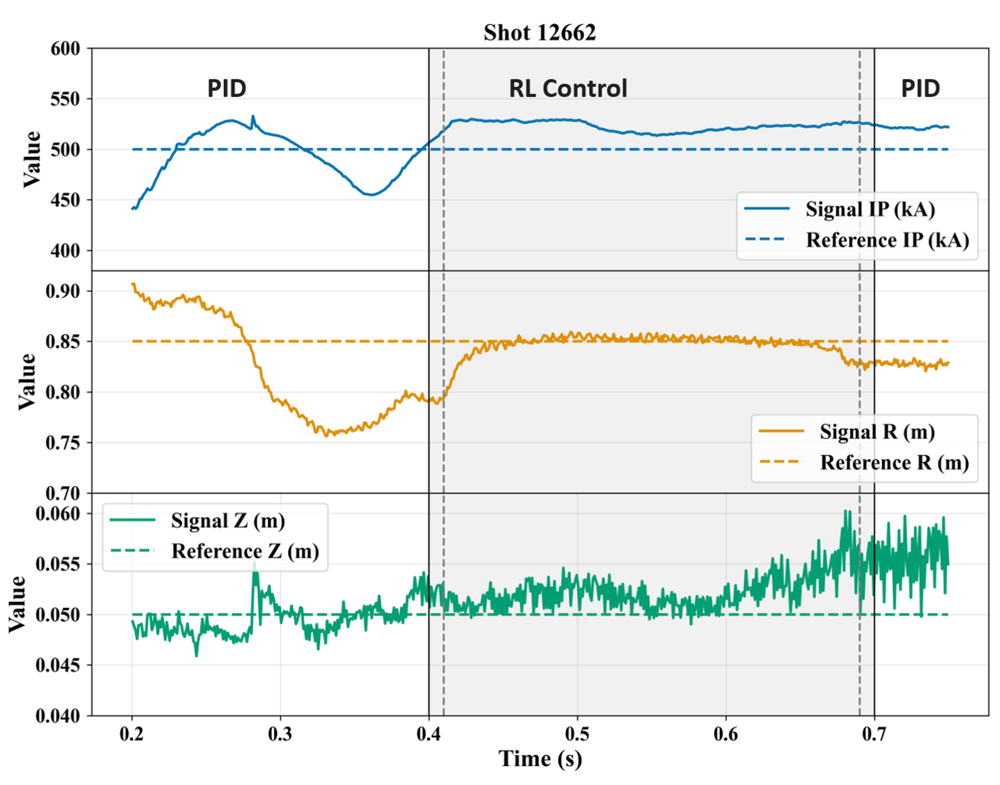
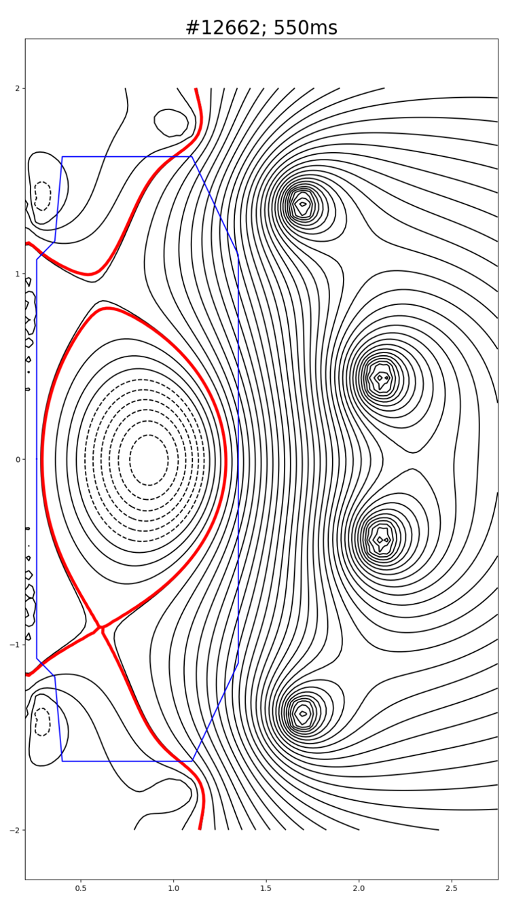
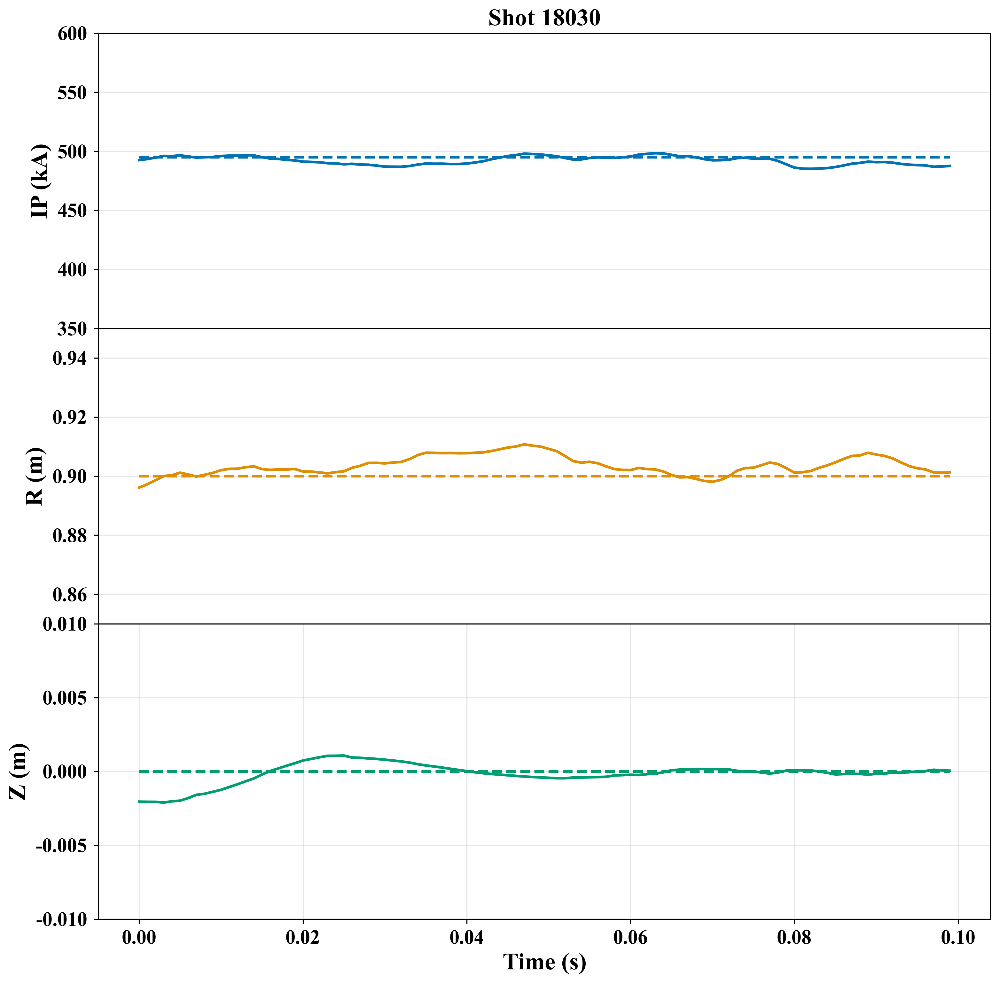

# Fusion Control Competition Environment

本目录提供聚变智能控制赛题的本地训练与仿真测试环境。高保真仿真器（HFM）以 Docker 形式封装，Python 环境通过 socket 与仿真器通信，并对选手暴露 Gymnasium 风格接口。核心特点是：

- 观测为全量字典，包含当前步的完整物理量
- 动作为 12 维真实物理电压
- 每一步观测都带当前时刻 `reference`（目标值）
- 提供可选的 flatten 观测和 7 维动作示例（仅作训练参考，最终提交仍需转换为 12 维）
- 最终提交物为 Docker 镜像（包含 ONNX 推理服务），镜像中的 Dockerfile、start_infer.sh、run.sh 等不可修改

## 文档导航

建议按以下顺序阅读：

1. **赛题说明文档**：了解任务背景、评测规则和提交要求
2. **本文档（README.md）**：完成本地安装、仿真器启动、训练与自测流程
3. **docs/docker_runtime.md**：查看云服务直接部署 runtime 镜像的使用方式
4. **docs/reference.md**：查看 observation、action、reference 和配置的详细字段说明
5. **submission/README.md**：了解提交镜像的构建、HTTP 接口、约束条件（不可改的 Dockerfile、启动脚本等）

## 项目目录结构

```text
fusion-control-comp/
├── configs/         # 默认配置
│   ├── env_default.yaml
│   └── shots.yaml
├── docs/
│   ├── Architecture.png
│   ├── docker_runtime.md
│   ├── shape.md
│   ├── reference.md
│   ├── XPT_CONTROL.md
│   └── ...
├── environment/     # 环境实现
│   ├── hfm_simulator.py
│   ├── hfm_predictor.py
│   ├── xpt_utils.py # XPT 观测提取、等磁通、Br/Bz（可选）
│   ├── preprocessing.py
│   ├── shot_registry.py
│   ├── wrappers.py
│   └── __init__.py
├── examples/        # 示例脚本
│   ├── train_f1_ppo.py
│   ├── train_f2_ppo.py
│   ├── semifinal_training_common.py
│   └── example_power_supply_step.py
├── tools/           # 启停仿真器
│   ├── start_simulator.py
│   └── stop_simulator.py
├── test/            # 环境与 submission 测试
│   ├── smoke_test_environment.py
│   ├── check_submission.py
│   └── test_submission.py
├── evaluation/      # 本地离线评分脚本与示例结果
│   ├── eval/
│   └── results/
└── submission/      # 最终提交模板（详见 submission/README.md）
    ├── Dockerfile   # 正式提交用，勿改
    ├── start_infer.sh
    ├── run.sh
    ├── inference1.py
    ├── inference2.py
    ├── service1.py
    ├── service2.py
    ├── requirements.txt
    ├── README.md
    └── model/
```

## 赛题与上机说明

本节给出整体上机流程与真实装置实验结果，帮助参赛者快速理解任务背景与预期目标。

### 整体技术方案

本赛题核心思路是：

> 在高保真环境中离线训练控制器，然后将神经网络控制器部署于真实装置，以毫秒级频率控制 12 组极向场（PF）及中心螺线管（CS）线圈电压，精确追踪等离子体电流 Ip、径向位置 R 和垂直位置 Z 的时间轨迹。

### 控制架构总览



该控制架构可按以下 4 个部分理解：

1. **比赛环境**：以 HFM 仿真器为核心，提供与真实装置一致的状态演化和控制接口，作为训练与验证基础（详见下文仿真环境）。
2. **强化学习案例**：基于环境提供的观测与动作空间，使用示例训练脚本（如 PPO）完成策略学习与模型导出（详见 Examples 文件）。
3. **控制算法部署**：将训练后的策略封装到推理服务中，通过标准接口输出 12 维真实电压用于在线控制（由主办方提供）。
4. **评价与打分**：在统一评测流程下，对各控制目标及位形跟踪误差进行综合评估，得到最终分数（详见下文 Example 说明）。

### 关键上机实验结果

以下结果来自 EXL-50U 真实放电实验，用于展示该技术路线在真实装置中的效果。

#### 偏滤器位形（Divertor）

- **放电 #12662**：实现 **300 ms** 稳定偏滤器位形控制



---

回到赛题本身：选手需要针对高保真 HFM 仿真环境设计控制策略，核心控制目标包括：

- 等离子体电流 `Ip`（单位：A）
- 等离子体位置 `R`、`Z`（单位：m）
- 最外闭合磁面接口 `lcfs_points`

任务形态包括两类：

- `hold`：维持初始状态不变，reference 由 reset 初态自动生成
- `trajectory`：跟踪人为指定的逐时刻 reference 轨迹

说明：

- 环境内部测试会覆盖不同 shot 和不同 reference 任务
- 选手训练时可以自行设计 reward
- 正式评测时只接收推理服务，不暴露评测代码

对 AI 选手更直观的理解是：

- `Ip` 决定电流跟踪质量
- `R`、`Z` 决定等离子体中心位置
- `lcfs_points` 对应最外闭合磁面边界点，用于描述整体位形轮廓
- 其余观测量主要作为辅助状态，帮助模型判断当前位置、形状变化趋势和控制响应

## 仿真环境准备

### 1. 安装 Python 环境

```bash
conda create -n competition_env python==3.11
conda activate competition_env
cd fusion-control-comp/
pip install -e .
```

如果你需要运行 SB3 训练和 ONNX 导出示例：

```bash
pip install stable-baselines3 torch onnx
```
其余训练框架由选手自行选择安装

### 2. 准备 HFM 仿真环境

根据运行环境不同，选手可选择以下两种方式之一启动 HFM 仿真服务。

#### 方案 A：通过 Docker 启动仿真器

适用场景：本地机器或可直接运行 Docker 的服务器。

复赛环境镜像链接：`crpi-q4qg69o2szruzmaa.cn-beijing.personal.cr.aliyuncs.com/enn_smart/hfm_server:competition-v0.2`

请先拉取比赛提供的复赛环境镜像，并打上本地标签：

```bash
docker pull crpi-q4qg69o2szruzmaa.cn-beijing.personal.cr.aliyuncs.com/enn_smart/hfm_server:competition-v0.2
docker tag crpi-q4qg69o2szruzmaa.cn-beijing.personal.cr.aliyuncs.com/enn_smart/hfm_server:competition-v0.2 hfm-matlab-server:competition
```

重点：本地标签必须保持为 `hfm-matlab-server:competition`。训练启动脚本会读取这个本地镜像名；远端 tag 使用 `competition-v0.2` 是为了区分复赛环境与初赛 `competition` 镜像。

启动单实例：

```bash
cd tools
python start_simulator.py -n 1 -y
```

关闭：

```bash
python stop_simulator.py
```

#### 方案 B：直接使用 runtime 镜像

适用场景：云服务可直接部署镜像，但当前环境不便再额外启动 Docker 容器。

此方式下无需在训练环境中再拉起仿真器容器，可直接部署主办方提供的 runtime 镜像。

- runtime 镜像链接：`[待补充]`
- 启动方式与依赖说明：参考 `docs/docker_runtime.md`

说明：

- 默认对外端口从 `5558` 开始
- 端口需与 `configs/env_default.yaml` 中 `predictor.port` 一致
- 无论采用 Docker 方式还是 runtime 镜像方式，Python 训练侧均通过 socket 与 HFM 服务通信
- 多实例并行训练请分别参考对应启动方式进行端口配置

## 训练环境：HFMSimulator 与 HFMSocketPredictor

### `HFMSocketPredictor`（底层通信层）

`environment/hfm_predictor.py` 中的 `HFMSocketPredictor` 负责与 Docker 仿真器通过 socket 通信：

- 连接到 Docker HFM 仿真器（地址和端口由 `env_default.yaml` 指定）
- 对每个 `shot_id` 固定维护 `L_addr`、`LX_addr` 等地址映射
- reset 接口仅暴露 `signeo`、`bp`、`q0` 三个扰动参数
- 接收并执行 12 维真实电压动作

### `HFMSimulator`（训练接口）

`environment/hfm_simulator.py` 是选手训练直接使用的 Gymnasium 标准环境，对外暴露：

- `reset(seed, options)`：重置 episode，支持自定义 reset_params 和 reference 模式
- `step(action)`：执行 12 维真实电压动作，返回 observation、reward、terminated 等
- `close()`：清理资源

基本使用示例：

```python
import yaml
from environment import HFMSimulator

with open("configs/env_default.yaml", encoding="utf-8") as f:
    config = yaml.safe_load(f)

env = HFMSimulator(config)
obs, info = env.reset(seed=42)
action = env.action_space.sample()
obs, reward, terminated, truncated, info = env.step(action)
env.close()
```

如果你想在 `reset()` 时显式更新初始平衡相关参数 `signeo`、`bp`、`q0`，可以这样传入 `options`：

```python
options = {
    "reset_params": {
        "signeo": 7.2e6,
        "bp": 0.20,
        "q0": 1.6,
    }
}

obs, info = env.reset(seed=42, options=options)
```

复赛训练示例见 `examples/train_f1_ppo.py` 和 `examples/train_f2_ppo.py`，其中演示了如何使用目标 reference 构造 trajectory 训练。

**说明**：
- `HFMSimulator` 在内部使用 `HFMSocketPredictor` 与 Docker 仿真器通信
- 选手只需调用 `HFMSimulator` 接口，无需直接使用 `HFMSocketPredictor`

## 关键配置

`configs/env_default.yaml` 中最常用的配置如下：

- `max_steps`：单个 episode 的最大步数，默认 `100`，当前场景最长支持 `499`
- `reference.mode`：默认 reference 模式，`hold` 或 `trajectory`
- `predictor.host`：Docker 仿真器地址，默认 `127.0.0.1`
- `predictor.port`：Docker 仿真器端口，默认 `5558`
- `predictor.timeout`：socket 超时时间
- `predictor.shot_id`：初始化所使用的平衡场景

说明：

- `shot_id` 决定底层仿真初始化所用的平衡配置
- `lcfs_points` / `reference_lcfs_points` 现在固定为 `32 x 2`，不再通过配置项暴露
- 更详细的字段和维度说明见 `docs/reference.md`

## 环境输入输出说明

### observation

环境输出为全量字典，重点可分为三类：

- 核心控制目标：`Ip`、`R`、`Z`、`lcfs_points`
- 当前步目标：`reference_Ip`、`reference_R`、`reference_Z`、`reference_lcfs_points`
- 辅助状态量：`I_PF`、`Rmax`、`Rmin`、`aminor`、`deltal`、`deltau`、`kappa`、`Bm`、`Fx` 等

说明：

- `observation` 每一步都带当前 reference
- `lcfs_points` 表示最外闭合磁面边界点序列，每个点为一组 `(R, Z)` 坐标
- 底层 环境中边界相关量可表示为 `rB` / `zB` 等坐标数组；在本环境里统一封装为 `lcfs_points`
- 详细字段名、维度和作用关系见 `docs/reference.md`

### action

- 标准动作空间为 12 维
- 每个维度都是真实物理电压
- 最终提交阶段也必须返回 12 维真实电压
- 默认动作上下界见 `environment/hfm_simulator.py`

### reset / reference

`reset(options=...)` 中当前主要开放：

- `reset_params.signeo`
- `reset_params.bp`
- `reset_params.q0`
- `reference_mode`
- `reference`

示例：

```python
options = {
    "reset_params": {
        "signeo": 7.2e6,
        "bp": 0.20,
        "q0": 1.6,
    },
    "reference_mode": "trajectory",
    "reference": {
        "Ip": np.linspace(4.95e5, 5.05e5, 100),
        "R": np.linspace(0.79, 0.81, 100),
        "Z": np.zeros(100),
    },
}
```

说明：

- `hold` 模式下，reference 由 reset 初态自动生成
- `trajectory` 模式下，可显式传入 `Ip`、`R`、`Z`、`lcfs_points` 的逐步目标
- 推荐先从 `Ip` 和 `R` 的轨迹变化开始做训练，再逐步加入更复杂的位形目标
- `reset_params` 可用于对初始平衡做扰动增强，提升泛化能力

### `shot` 是什么

可以把 `shot` 理解为官方提供的预设环境模板。每个 `shot_id` 固定了一组底层平衡配置和默认初始参数，方便选手直接开始训练。

当前提供 4 组 `shot`：

- `13844_500`
- `13844_600`
- `15892_400`
- `15892_500`

建议先固定一个 `shot` 跑通环境，再逐步加入 `reference` 变化和 `reset_params` 扰动来提升泛化能力。

## 训练建议

在环境跑通、接口含义明确之后，再开始系统调参通常更高效。为了提高策略对不同初始条件和 reference 任务的泛化能力，建议训练时不要只覆盖 `hold` 任务，也加入一定比例的 `trajectory` 任务。

推荐的基础做法是优先围绕 `Ip` 和 `R` 构造变轨迹训练：

- `Ip`：相对初始目标做 `±100 kA` 范围内的变化
- `R`：相对初始目标做 `±3 cm` 范围内的变化
- `Z`：基础阶段可先保持不变
- `lcfs_points`：基础阶段可先保持不变，后续再逐步增加边界跟踪训练

另外，建议在 `reset_params` 中加入一定随机扰动，用于提升模型对不同初始平衡和隐藏测试条件的鲁棒性。一个实用的起点是：

- `signeo`：相对初始值扰动 `±50%`
- `bp`：相对初始值扰动 `±10%`
- `q0`：相对初始值扰动 `±10%`

这些扰动会影响等离子体的初始位置、形状和后续动态响应。更详细的参数说明见 `docs/reference.md`。

## Example 说明

### 复赛训练示例

- `examples/train_f1_ppo.py`：使用 `configs/f1_reference_targets.json` 构造 F1 限制器目标 reference，并训练 7 维对称动作 PPO。
- `examples/train_f2_ppo.py`：使用 `configs/xpt_reference_targets.json` 构造 F2a/F2b XPT 目标 reference，并训练 7 维对称动作 PPO。
- `examples/semifinal_training_common.py`：两个训练脚本共用的 reference、reward、wrapper 和 PPO 启动逻辑。
- `examples/example_power_supply_step.py`：电源模型阶跃响应示例。

### 工具脚本

- `tools/smoke_test_environment.py`：不依赖仿真器的本地结构检查
- `test/check_submission.py`：构建 submission docker 并验证 API
- `test/test_submission.py`：用真实环境联调 submission 服务

如果你已经基于示例完成训练并导出了模型，下一步就是把策略封装成提交所需的 ONNX 推理服务。

## ONNX 导出与提交工作流

本地训练完成后，需要将模型导出为 ONNX 格式，并按 `submission/` 目录的要求打包为 Docker 镜像。复赛使用双服务提交模板，具体模型命名、推理入口和本地检查方式以 `README_SEMIFINAL.md` 与 `submission/README.md` 为准。

### 推荐流程（示例）

```bash
# 1. 启动本地仿真器
cd tools
python start_simulator.py -n 1 -y

# 2. 训练模型（示例：F1 或 F2）
cd ../examples
python train_f1_ppo.py
# 或
python train_f2_ppo.py

# 3. 检查 submission 镜像（仅验证服务是否可用，不运行完整评测）
cd ../test
python check_submission.py

# 4. 使用真实仿真环境联调 submission 服务
python test_submission.py --launch-service docker --service-url http://127.0.0.1:18001

# 5. 如无问题，按 submission/README.md 构建正式镜像并提交
```

**注意**：
- 复赛模型文件和推理入口见 `README_SEMIFINAL.md` 与 `submission/README.md`
- `submission/Dockerfile`、`start_infer.sh`、`run.sh` 及容器内路径均**不可修改**，详见 `submission/README.md`

### 本地评估

离线评估脚本位于 `evaluation/` 目录，用法如下：

```bash
cd evaluation/eval
python3 evaluate.py <target_path> <infer_result_path>
```

- `<target_path>`：标准答案文件，格式参见 `evaluation/results/target.json`
- `<infer_result_path>`：选手推理结果文件，格式参见 `evaluation/results/infer_result.json`

示例：

```bash
cd evaluation/eval
python3 evaluate.py ../results/target.json ../results/infer_result.json
```

输出为 JSON，包含 `score`（总分）和各子任务的误差明细。

## 7 维动作：经验降维参考

比赛的**正式接口仍为 12 维真实电压动作**。`environment/wrappers.py` 中提供了 `Action7DTo12DWrapper` 和 `action_7d_to_12d()`，这是一种**降维参考方案**，仅用于快速实验和早期调参。

**关键约束**：
- 7 维动作映射**仅作训练阶段和策略内部降维参考**
- 如模型内部输出 7 维，**必须在推理入口中自行映射回 12 维**后再提交
- **正式提交的镜像必须返回 12 维真实电压**

### 7 维到 12 维的映射逻辑（参考）

核心假设：中间 10 维线圈为上下对称线圈，按 5 组对称处理，每组共享同一电压。映射关系如下：

```
v[0]  → u[0]        # 第 1 维单独控制
v[1]  → u[1] = u[2] # 第 2 和第 3 维共享
v[2]  → u[3] = u[4]
v[3]  → u[5] = u[6]
v[4]  → u[7] = u[8]
v[5]  → u[9] = u[10]
v[6]  → u[11]        # 第 7 维为快控线圈电压，单独控制
```

这种对称保持的做法通常更有利于维持等离子体整体稳定。复赛动作建议和提交细节见 `README_SEMIFINAL.md`。

## 示例结果与评分（参考）

下面给出一组示例可视化结果（仅用于说明训练与提交流程已跑通）：



- **示例评分：3.65 分**（100 步推理，仅用于验证流程是否跑通，正式比赛为 500 步）
- 各子项误差（越小越好）：

  | 指标 | 误差均值 |
  |------|----------|
  | Ip 电流误差 ε_Ip | 1.3685 |
  | 位置误差 ε_pos | 1.4330 |
  | 形状误差 ε_lcfs | 0.8548 |

- 实际成绩会随训练配置、随机种子和评测集变化而波动。

### Windows 已知问题：OpenMP DLL 冲突
在 Windows 本地联调时，若出现 `libomp.dll` 与 `libiomp5md.dll` 冲突（OpenMP runtime duplicate），可临时设置：
```bash
set KMP_DUPLICATE_LIB_OK=TRUE
```

## 已知问题修复

### reset 后偶发 `JSONDecodeError: Expecting value: line 1 column 1 (char 0)`（已修复）

- **现象**：`env.reset()` 看似成功，紧接着第一次 `env.step()` 抛 `json.decoder.JSONDecodeError`，报错点在 `environment/docker_socket_predictor.py` 的 `return json.loads(self._read_line())`。
- **原因**：客户端把 `RESET\n` 与参数行 `{...}\n` 分两次 `sendall()` 发出，仿真器在收到 `RESET\n` 后只对参数做约 1–10 ms 的 peek。当 OS 抖动 / GC / Docker Desktop 网络栈让两次 `sendall` 之间间隔 ≥ 10 ms 时，参数行错位为下一条命令，污染输入流，下一次 `step()` 实际读到 `ERROR: Unknown command\n`，于是 `json.loads` 失败。
- **修复**：客户端改为单次原子 `sendall()`（`environment/docker_socket_predictor.py` 中新增 `_send_lines`，`INIT/RESET/STEP` 的命令+负载合并发送）。
- **是否需要选手改代码**：**不需要**。`reset()` / `step()` 接口与返回值完全保持向后兼容。
- **如何拿到修复**：拉取最新代码后重新 `pip install -e .`（或重新拉取本目录）即可。
- **如何自测**：旧版本机器上若曾偶发此错，可用 `examples/train_f1_ppo.py --total-timesteps 10` 跑通 reset+step；如仍能复现，请联系赛事方并提供 `docker logs <hfm-matlab-server>` 末尾若干行。
