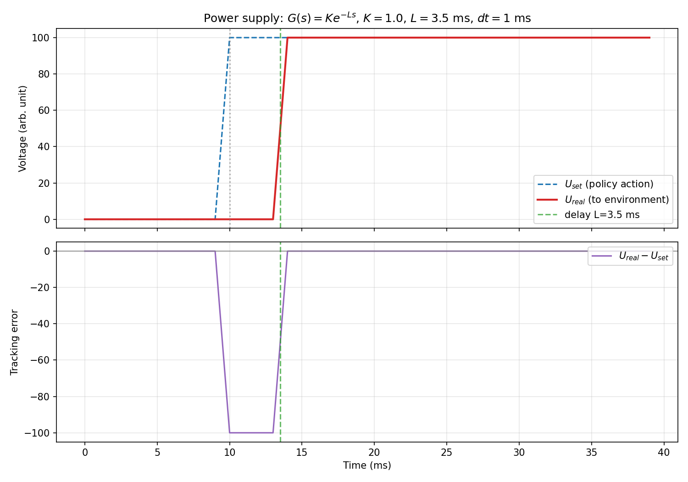

# 电源模型

本环境在策略电压指令与 HFM 实际输入之间加入电源响应模型，位于 `environment/power_supply.py`，由 `HFMSocketPredictor.step()` 自动调用。

## 信号链

每个仿真步（1 ms）按以下顺序处理 12 路电压：

```text
U_set[k]  策略给出的电压指令
   |
   v  ① 传输时延：取 U_set[k - d_i[k]]（历史不足时用首步指令填充）
   |
   v  ② 速率限制：|u_r[k] - u_r[k-1]| <= max_change_i
   |
   v  ③ PSM 仿射：U_real[k] = slope_i * u_r[k] + intercept_i
   |
HFM predictor
```

## 公式

对第 `i` 路电源，在第 `k` 个仿真步：

```text
u_d,i[k] = U_set,i[k - d_i[k]]

u_r,i[k] = clip(
    u_d,i[k],
    u_r,i[k-1] - Δu_i^max,
    u_r,i[k-1] + Δu_i^max
)

U_real,i[k] = a_i * u_r,i[k] + b_i
```

其中：

- `U_set,i[k]`：策略在第 `k` 步输出的第 `i` 路电压指令。
- `d_i[k]`：第 `i` 路电源在第 `k` 步使用的离散延迟步数，由连续延迟时间按 `dt = 1 ms` 换算得到。
- `u_d,i[k]`：经过传输延迟后的电压指令。
- `u_r,i[k]`：经过变化率限幅后的电压。
- `Δu_i^max`：第 `i` 路每步允许的最大电压变化量。
- `a_i, b_i`：第 `i` 路 PSM 标定参数。
- `U_real,i[k]`：最终送入 HFM 的实际电压。

历史不足时，延迟项使用 episode 首步电压指令填充；每次 reset 会清空历史状态。默认配置下，延迟会在每个仿真步重新采样；如果构造 `PowerSupplyModel(delay_s=...)` 显式传入延迟，则使用固定延迟，便于调试和对照实验。

## 参数

| 项 | 说明 |
|----|------|
| PSM slope / intercept | 12 路实测标定常数（替换原占位 K/b） |
| 时延 ch0–10 | 默认每步在 2–5 ms 内随机采样 |
| 时延 ch11 (VS) | 默认每步在 0–1 ms 内随机采样 |
| 速率限制 | 7 路模板经 12D 映射，每步最大变化量 |

选手仍只输出 12D 电压指令；实际进入 HFM 的电压经过上述模型。建议训练时覆盖一定延迟扰动以提升策略鲁棒性；电压变化率限幅按当前公开配置执行。

## 示例

```bash
python examples/example_power_supply_step.py
```


